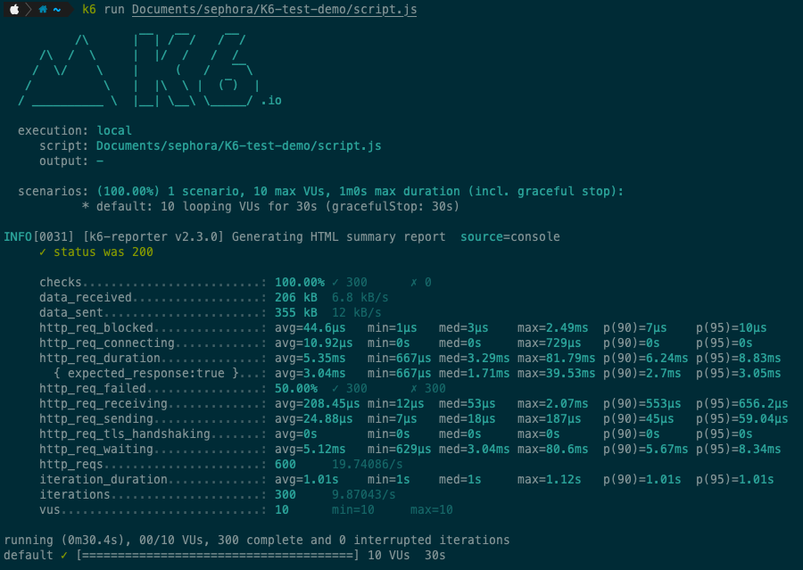
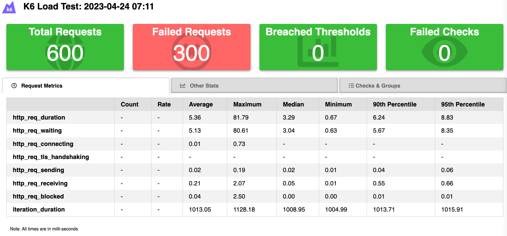

# K6-pressure-test

**名词解释：**

tps: 每秒能处理的请求数

rps: 每秒发起的请求数

P95: 对应TPS的请求量下，95%的请求处理的平均时间

---

***options配置内***

vus(virtual users): 虚拟用户数

duration: 持续时间

iterations: 迭代次数

stages：阶段，不同阶段时的配置

target: 目标，每个阶段的目标虚拟用户数

---

***default function***

url: 请求地址

payload: 请求参数

headers: 请求头

method: 请求方法

check: 阈值，用于判断是否通过测试

---

***输出***

默认是通过CLI进行输出，比如：

添加了组件textSummary，可以转为html进行输出，代码中的输出目录不是项目根目录，而是本机的根目录，可自行修改。

